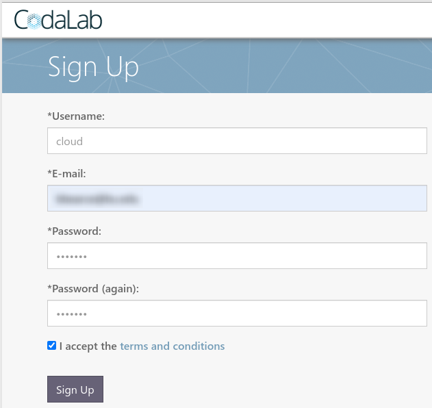
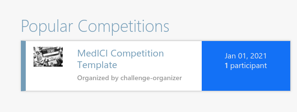
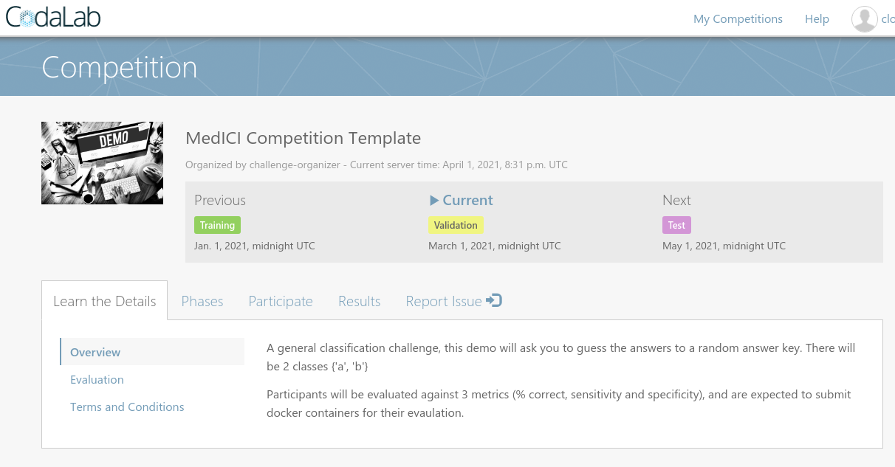
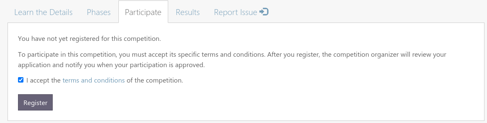
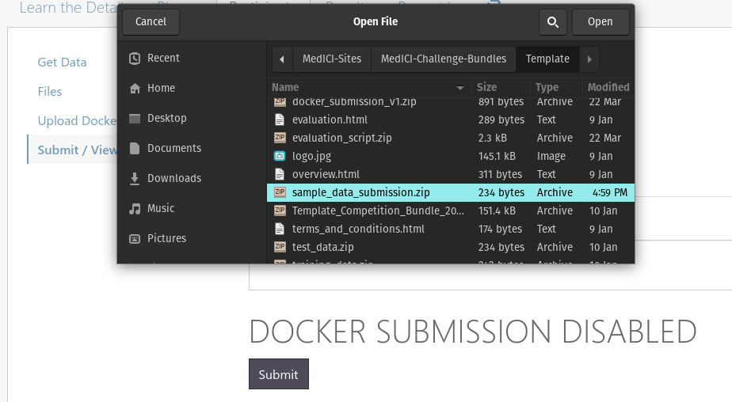
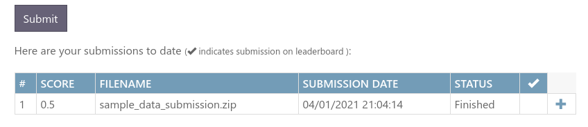
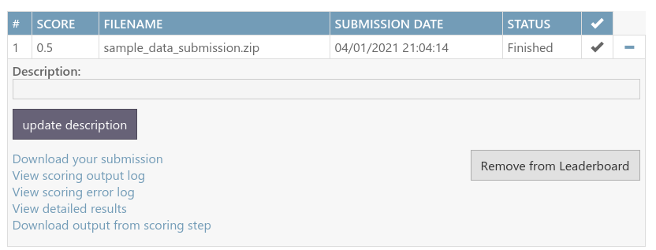
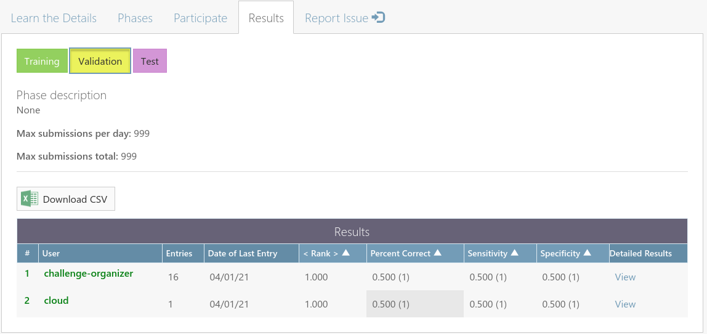
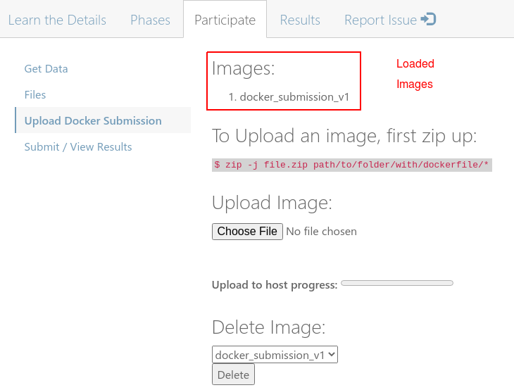
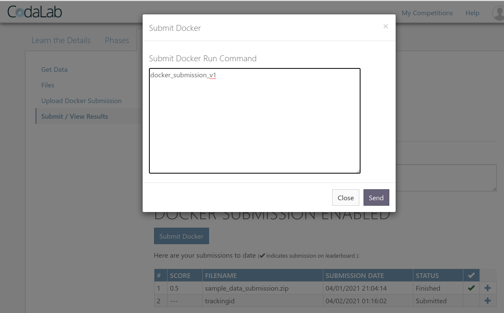

# General Challenge Useage

## Overview
A general classification challenge, this demo will ask you to guess the answers to a random answer key. There will be 2 classes {'a', 'b'}

Participants will be evaluated against 3 metrics (% correct, sensitivity and specificity), and are expected to submit docker containers for their evaulation.

## Get Data
The dataset consists of fake data that will be evaluated. It will have an answer key.

Participants are asked to submit files that contain the key, representing classification cases, and class (one of three choices within set {'a','b'}). The contents of an example sumission file is shown below:

|key|class |
|---|------|
|1  |a     |
|2  |a     |
|3  |b     |
|4  |a     |
|5  |b     |
|6  |b     |
|7  |a     |
|8  |a     |
|9  |b     |
|10 |b     |

## Evaluation
The challenge will consist of three phases: a training phase, a validation (or fine-tuning) phase, and a final test phase.

Each will have the same scoring mechanism looking for:  
1. % Correct  
2. Sensitivity  
3. Specificity  

## Terms and Conditions
Docker image is the submission medium of choice.
Must have a partnersID to participate in the challenge

## Non Docker Submission

### Register for the challenge:
Sign up for the website in general in the upper right on the Sign Up link.


> You will have to verify email on prod environment

### Register for the Challenge
On the main page find the challenge and select it:  


The challenge landing page should have intitive tabs with the same content you saw at the beginning of this tutorial.  


Select the *Participate* tab to begin registgration.


Once registered select "Submit / View Results" on the left to make your first submission

### Submit example
Create the csv specified in Get Data and zip it to a folder. On linux this is done like so:
```
zip -j sample_data_submission.zip path_to_csv_or_folder_for_csv/*
```

Use the submit button to submit zipped up csv file:


It should finish and afterwards if you refresh the page you can see a score:


Expand results with the "+" button to the right and add to leaderboard:


Next to the *Participate* tab should be a *Results* tab where you can view the results on the main leaderboard (which can be hidden).


### Summary
That is most basic challenge type (data submission). These challenges can have participants submit essentially any data type (text, csv, image) and then that can be judged an a custom way with a socring program. This example compared a submission csv to a ground truth csv.

Proceed to the next section to recreate this demo with a docker submission

## Docker Submission

### Upload Docker Submission Template
In the same git repo we are in go up one level to the *Template* folder. This is the Template Challenge source code. Go into the *docker_submission_template* folder

To create a docker submission, zip this up just like the other data submission; just make sure you get both the Dockerfile and submission.py

```
zip -j docker_submission_v1.zip \
       docker_submission_template/Dockerfile \
       docker_submission_template/submission.py
```

Goto the *Upload Docker Submission* left side tab under the main *Participate* tab. Use the *Choose File* button to upload the zip file you just made.



Already uploaded images will be under the "Images:" heading. Copy the uploaded image name to your clipboard and head to the *Submit / View Results* side tab under *Participate*.

Once there clck the *Submit Docker* button and paste in the image name you copied and click send.


Your results should be visible once the job is done as before in the results table below.

### Understanding The Upload Docker Submission Template

[1] Assuming you are still in the *dockersubmission_template* folder and assuming you have docker installed locally or on a server to practice, run this code to build an image:

```
$ docker build -t repo_example/image:latest .
Sending build context to Docker daemon  42.87MB
Step 1/4 : FROM python:3.10.0a4-slim-buster
 ---> f9a64bb647af
Step 2/4 : WORKDIR ./workspace
 ---> Using cache
 ---> bb043e6f5cdb
Step 3/4 : COPY submission.py /workspace
 ---> Using cache
 ---> fd78b624134e
Step 4/4 : CMD ["python", "submission.py"]
 ---> Using cache
 ---> aa0ccc3f7c51
Successfully built aa0ccc3f7c51
Successfully tagged repo_example/image:latest
```

[2] Now we can see what this does. Setup an evaluation environment with this code (this mimics what will happen on the system at run time):
```
$ mkdir -p input_data # input data source
$ mkdir -p input/ref # groud truth
$ mkdir -p input/res # results from participant algorithm
$ mkdir -p output # scoring program output
```

[3] Make a sample ground truth file as such and put it in the *input/ref/* directory.:

*ground_truth.csv*  
```
key,class 
1,a 
2,a 
3,b 
4,a 
5,b 
6,b 
7,a 
8,a 
9,b 
10,b 
```

[4] Make the input data file, which is just a key and could be actual images, and put in *input_data*

*input_data.csv*
```
key
1
2
3
4
5
6
7
8
9
10
```

[5] Run this command to create a prediction:

```
$ docker run \
  -v $PWD/input_data:/mnt/in \
  -v $PWD/input/res:/mnt/out \
  repo_example/image:latest 
```

If all goes well you should see "output_data.csv" under */input/res*. This is titled this way from the perspective of the scoring program. Its input is the result of the participant output, or "results","res" for short.

All participants need to know is where their data comes from and where to put results.

You'll notice in *docker_submission_template/submission.py* that all caps variables IN and OUT are set to paths '/mnt/in' and 'mnt/out'. Those directories will be mounted during execution and will provide your input data and a place to put your algorithm output. 