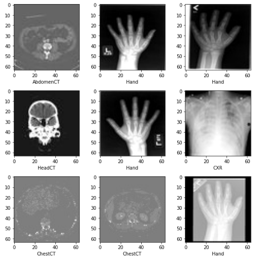

# MedNIST

## Intro and Context
The MedNIST dataset was gathered from several sets from TCIA, the RSNA Bone Age Challenge, and the NIH Chest X-ray dataset.



The dataset is kindly made available by Dr. Bradley J. Erickson M.D., Ph.D. (Department of Radiology, Mayo Clinic) under the Creative Commons CC BY-SA 4.0 license. If you use the MedNIST dataset, please acknowledge the source, e.g.

Original [Jupyter Notebook](https://colab.research.google.com/drive/1wy8XUSnNWlhDNazFdvGBHLfdkGvOHBKe#scrollTo=JeC6o5OMAFN7) that this is based on is linked. Beware that in the Jupyter example, ~60,000 images are used and downloaded. Here we use 1,800 in a split with 600 images each for training, validation, and testing.

> You do not need to download the original data to use this tutorial. The 1800 images are provided for you. 

The [Project Monai](https://github.com/Project-MONAI/MONAI) [docker image](https://hub.docker.com/r/projectmonai/monai) is used (```projectmonai/monai:latest```) from Dockerhub as the base image for both training and inference.

After Training and Inference (classification) are performed you will be scored using the ```sklearn.metrics.classification_report``` method. From the [sklearn docs](https://scikit-learn.org/stable/modules/generated/sklearn.metrics.classification_report.html) this is what is calculated:

> The reported averages include macro average (averaging the unweighted mean per label), weighted average (averaging the support-weighted mean per label), and sample average (only for multilabel classification). Micro average (averaging the total true positives, false negatives and false positives) is only shown for multi-label or multi-class with a subset of classes, because it corresponds to accuracy otherwise and would be the same for all metrics.

When scored, we will report these metrics and display them on the leaderboard:

* weighted average precision
* weighted average recall
* weighted average f1-score

Clone repo:
```
git clone https://github.com/QTIM-Lab/MedICI-Challenge-Bundles.git
```

If you cloned this whole repo then we need to find our way to this directory:
## Linux and MacOS
```
cd MedICI-Challenge-Bundles/aks_MedNIST_bundle
```
## Windows
Change directories into ```.\MedICI-Challenge-Bundles\aks_MedNIST_bundle``` from your present working directory.

At this "root" level is where the following commands will be run.

# Docker Installation
[Official Docs](https://docs.docker.com/engine/install/)

> I noticed during Windows install that the WSL for linux might not properly install by default. In fact it may cause Windows to not install docker at all. If this is the case one thing that worked was to uncheck the "WSL" install option upon installation and install WSL separately. WSL stands for Windows Subsystem in Linux. Installing WSL and docker separately and then restarting the machine seemed to work.

Docker is not by default in the sudoers group on linux and maybe macOS. On linux and macOS you can run this command to add docker to the sudo group:
```
sudo usermod -aG docker $USER
```

On windows it works a little differently I believe and you need to add yourself to the docker group...further instructions are tbd.

# Training
## Build Training Docker Image:
```bash
docker build -f docker_code_training/Dockerfile -t medicichallenges/mednist:training docker_code_training;
```
## Run Training Image

```bash
docker run \
  -it \
  --rm \
  --shm-size=256m \
  -v $PWD/input_data:/mnt/in \
  -v $PWD/model_output:/mnt/out \
  medicichallenges/mednist:training \
  python app.py
```
> Might take ~5 min

There should be a model in ```$PWD/model_output```, saved by ```torch.save(model.state_dict(), os.path.join(OUT,'best_metric_model.pth'))``` on line ~160

# Inference - Run by Challenge Platform
Now that you have a model created and saved, we need to package that up with inference code to do the inference phase.
## Build inference image (what participants submit)
```bash
docker build -f docker_code_inference/Dockerfile -t medicichallenges/mednist:inference .
```
Now run the inference image:

```bash
docker run \
  -it \
  --rm \
  --shm-size=256m \
  -v $PWD/input_data/testing-data:/mnt/in \
  -v $PWD/submission_directory/input/res:/mnt/out \
  medicichallenges/mednist:inference \
  python inference_on_test.py
```
> You'll notice I mount ```$PWD/submission_directory/input/res``` in order to make sure the results of classification are available to the scoring program. See below section for details.

# Create submission for platform (website submission)

Zip up your inference model, Dockerfile and code into a *.zip file and upload to the platform:

## Linux and MacOS
You can use this sample bash code to zip up their submission:
```
zip -j mednist_docker_image_inference.zip \
    docker_code_inference/Dockerfile
zip -r mednist_docker_image_inference.zip \
    docker_code_inference/inference_on_test.py \
    model_output
```

## Windows
Be sure to zip up into ```mednist_docker_image_inference.zip``` folders:

* ```docker_code_inference``` with it's contained inference_on_test.py code file.
* ```model_output``` folder with best_metric_model.pth model file.
* ```Dockerfile``` in the root directory

Either way for this example your .zip should look like this:
```
Dockerfile
docker_code_inference
    | inference_on_test.py
model_output
    | best_metric_model.pth
```

# Scoring - Run by Challenge Platform
> This section is extra and not necessary for demo, but might help understanding what is happening during a submission.

Before we continue, the scoring program will run in a specific directory structure:

```
Submission Directory:
  |- input
    |- ref (This is the reference data unzipped - ground truth participants do not have access to)
    |- res (This is the user submission - classification_results.csv)
  |- program (This is the scoring program [and any included dependencies] unzipped)
  |- output (This is where the scores.txt file is written by the scoring program)
```
The only thing you need to worry about here is that your output from your inference calculation will end up in ```input/res```. The rest is for the challenge organizer. The ```program``` folder will have the score program in it and we will use it to show how scores are calculated.

Create mock scoring docker image for testing:

```bash
docker build -f scoring_program/Dockerfile -t local/score_image:latest scoring_program
```

Now run the score program:
```bash
docker run \
  -it \
  --rm \
  -v $PWD/submission_directory:$PWD/submission_directory \
  -w $PWD/submission_directory \
  local/score_image:latest
```
